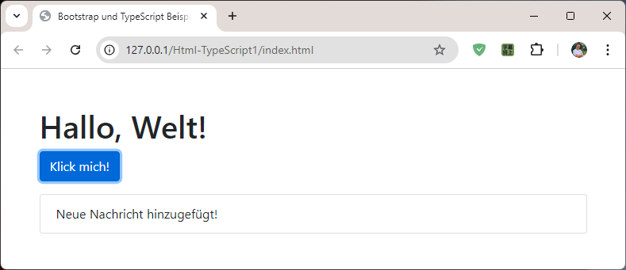

# Html-Bootstrap-TypeScript1

## Einführung

Dieses Projekt ist eine einfache Webanwendung, die mit TypeScript entwickelt wurde. 
Die Anwendung zeigt, wie man TypeScript in einem Webprojekt verwendet und wie man den TypeScript-Compiler im Watch-Modus nutzt, um Änderungen automatisch zu kompilieren.




## Projektstruktur

Folgende Verzeichnisstruktur für das Projekt erstellen

``` terminal
Html-TypeScript1/ 
├── index.html 
├── src/ 
│   └── app.ts 
└── js/
```


## TypeScript-Projekt initialisieren

```` terminal
tsc --init
````

tsconfig.json-Datei wird erstellt.


## /tsconfig.json

Die Konfigurationsdatei für den TypeScript-Compiler, die die Einstellungen für die Kompilierung enthält.

``` json
{
  "compilerOptions": {
    "outDir": "./js/",
    "rootDir": "./src",
    "target": "es5",
    "module": "commonjs",
    "strict": true
  },
  "include": ["src/**/*"]
}

```


## Automatisches Kompilieren von TypeScript-Dateien

Watch-Modus aktivieren. 
Die ts-Dateien werden automatisch bei Änderungen kompiliert. Führe dazu diesen Befehl im Terminal aus:

``` Terminal
tsc --watch
```

Dies wird den TypeScript-Compiler im Hintergrund ausführen und bei jeder Änderung der app.ts-Datei automatisch die JavaScript-Datei im js-Ordner aktualisieren.

WICHTIG! Befehl tsc dort ausführen, wo sich die tsconfig.json-Datei befindet.


## index.html

Die HTML-Datei, die die Webseite darstellt, erstellen.

```html
<!DOCTYPE html>
<html lang="en">
<head>
    <meta charset="UTF-8">
    <meta name="viewport" content="width=device-width, initial-scale=1.0">
    <title>TypeScript Web App</title>
</head>
<body>
    <h1>Willkommen zur TypeScript Web App</h1>
    <script src="js/app.js"></script>
</body>
</html>
```


## /src/app.ts 

Die TypeScript-Datei, die die Webanwendung implementieren.

``` js
document.addEventListener('DOMContentLoaded', () => {

    // Element-Referenzen abrufen
    const button = document.getElementById('clickMeButton');
    const msgList = document.getElementById('msgList');

    // Überprüfen, ob die Elemente vorhanden sind
    if (button && msgList) {

        // Klick-Ereignis für den Button hinzufügen
        button.addEventListener('click', () => {

            // Neues Nachrichten-Element erstellen
            const newMessage = document.createElement('li');
            newMessage.textContent = 'Neue Nachricht hinzugefügt!';
            newMessage.className = 'list-group-item';

            // Neue Nachricht zur Nachrichtenliste hinzufügen
            msgList.appendChild(newMessage);
            
        });
    }
});
```


## HTML-Anwendung ausführen

Web-Server starten, und zu index.html im Browser navigieren.


