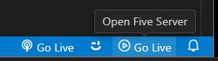

# Html-jQuery-TypeScript1

## Einführung

Dieses Projekt ist eine einfache Webanwendung, die mit jQuery und TypeScript entwickelt wurde. 
Die Anwendung zeigt, wie man jQuery und TypeScript in einem Webprojekt verwendet und wie man den TypeScript-Compiler im Watch-Modus nutzt, um Änderungen automatisch zu kompilieren.


## Projektstruktur

Folgende Verzeichnisstruktur für das Projekt erstellen

``` terminal
/Html-jQuery-TypeScript1/
  ├── /src/
  │    └── app.ts    (TypeScript-Datei)
  ├── /js/
  │    └── app.js    (kompilierte JavaScript-Datei, automatisch erstellt)
  ├── index.html     (HTML-Datei)
  ├── tsconfig.json  (TypeScript-Konfigurationsdatei)
```

## jQuery und Typdefinitionen installieren

Im Terminal zum Projekt-Order wechseln und folgende Befehle ausführen:

```` terminal
cd Html-jQuery-TypeScript1
npm install jquery
npm install --save-dev @types/jquery
````

Um jQuery und die dazugehörigen Typdefinitionen zu installieren, npm verwenden.


## TypeScript-Projekt initialisieren

```` terminal
tsc --init
````

tsconfig.json-Datei wird erstellt.


## /tsconfig.json

Die Konfigurationsdatei für den TypeScript-Compiler, die die Einstellungen für die Kompilierung enthält.

``` json
{
  "compilerOptions": {
    "outDir": "./js/",
    "rootDir": "./src",
    "target": "es5",
    "module": "commonjs",
    "strict": true
  },
  "include": ["src/**/*"]
}

```


## Automatisches Kompilieren von TypeScript-Dateien

Watch-Modus aktivieren. 
Die ts-Dateien werden automatisch bei Änderungen kompiliert. Führe dazu diesen Befehl im Terminal aus:

``` Terminal
tsc --watch
```

Dies wird den TypeScript-Compiler im Hintergrund ausführen und bei jeder Änderung der app.ts-Datei automatisch die JavaScript-Datei im js-Ordner aktualisieren.

WICHTIG! Befehl tsc dort ausführen, wo sich die tsconfig.json-Datei befindet.


## index.html

Die HTML-Datei, die die Webseite darstellt, erstellen.

```html
<!DOCTYPE html>
<html lang="de">
<head>
    <meta charset="UTF-8">
    <meta name="viewport" content="width=device-width, initial-scale=1.0">
    <title>jQuery und TypeScript</title>
</head>
<body>
    
    <div id="meinElement">Dieser Text wird ersetzt.</div>

    <!-- jQuery von einem CDN laden -->
    <script src="https://code.jquery.com/jquery-3.6.0.min.js"></script>

    <!-- Dein kompiliertes JavaScript-Skript einbinden -->
    <script src="js/app.js"></script> 

</body>
</html>
```


## /src/app.ts 

Die TypeScript-Datei, die die Webanwendung implementieren.

``` js
// src/app.ts

// Keine jQuery-Importe nötig, da es bereits im HTML geladen wird
console.log('Script geladen');

$(() => {
    console.log('jQuery initialisiert');
    $('#meinElement').text('Hallo Welt');
});


```


## HTML-Anwendung ausführen

Web-Server starten, und zu index.html im Browser navigieren.

Web-Server starten.


im Browser navigieren.


