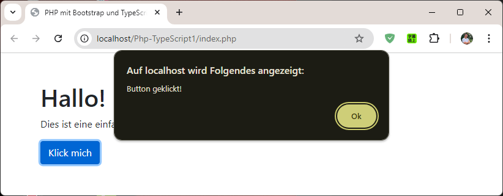

# Php-TypeScript1

## Einführung

Dieses Projekt ist eine einfache Webanwendung, die mit PHP unnd TypeScript entwickelt wurde. 
Die Anwendung zeigt, wie man TypeScript in einem PHP-Projekt verwendet und wie man den TypeScript-Compiler im Watch-Modus nutzt, um Änderungen automatisch zu kompilieren.




## Projektstruktur

Folgende Verzeichnisstruktur für das Projekt erstellen

``` terminal
Php-TypeScript1/ 
├── index.php 
├── src/ 
│   └── app.ts 
└── js/
```

## TypeScript-Projekt initialisieren

```` terminal
tsc --init
````

tsconfig.json-Datei wird erstellt.


## /tsconfig.json

Die Konfigurationsdatei für den TypeScript-Compiler, die die Einstellungen für die Kompilierung enthält.

``` json
{
  "compilerOptions": {
    "outDir": "./js/",
    "rootDir": "./src",
    "target": "es5",
    "module": "commonjs",
    "strict": true
  },
  "include": ["src/**/*"]
}

```

## Automatisches Kompilieren von TypeScript-Dateien

Watch-Modus aktivieren. 
Die ts-Dateien werden automatisch bei Änderungen kompiliert. Führe dazu diesen Befehl im Terminal aus:

``` Terminal
tsc --watch
```

Dies wird den TypeScript-Compiler im Hintergrund ausführen und bei jeder Änderung der app.ts-Datei automatisch die JavaScript-Datei im js-Ordner aktualisieren.

WICHTIG! Befehl ````tsc```` dort ausführen, wo sich die tsconfig.json-Datei befindet.


## /index.php

In der `index.php`-Datei, Bootstrap's CSS und JavaScript über CDN einbiden.

``` php 
<!DOCTYPE html>
<html lang="de">
<head>
    <meta charset="UTF-8">
    <meta name="viewport" content="width=device-width, initial-scale=1.0">
    <title>PHP mit Bootstrap und TypeScript</title>
    <!-- Bootstrap CSS -->
    <link href="https://stackpath.bootstrapcdn.com/bootstrap/4.5.2/css/bootstrap.min.css" rel="stylesheet">
</head>
<body>
    <div class="container">
        <h1 class="mt-5">Hallo!</h1>
        <p>Dies ist eine einfache PHP-Seite mit Bootstrap und TypeScript.</p>
        <button id="myButton" class="btn btn-primary">Klick mich</button>
    </div>

    <!-- Bootstrap JS und Abhängigkeiten -->
    <script src="https://code.jquery.com/jquery-3.5.1.slim.min.js"></script>
    <script src="https://cdn.jsdelivr.net/npm/@popperjs/core@2.9.3/dist/umd/popper.min.js"></script>
    <script src="https://stackpath.bootstrapcdn.com/bootstrap/4.5.2/js/bootstrap.min.js"></script>

    <!-- Kompilierte JavaScript-Datei aus TypeScript -->
    <script src="js/app.js"></script>
</body>
</html>
```

## /src/app.ts

Folgenden TypeScript-Code erstellen

``` typescript
document.getElementById('myButton')?.addEventListener('click', () => {
    alert('Button geklickt!');
});
```


## PHP-Anwendung ausführen

PHP-Server starten


Zu index.php im Browser navigieren.


