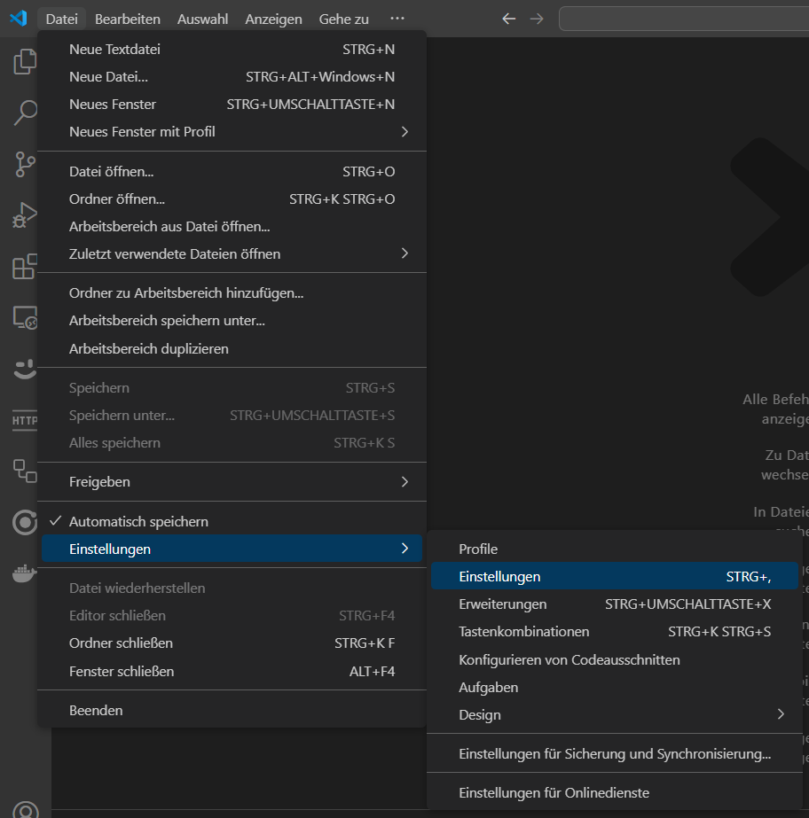
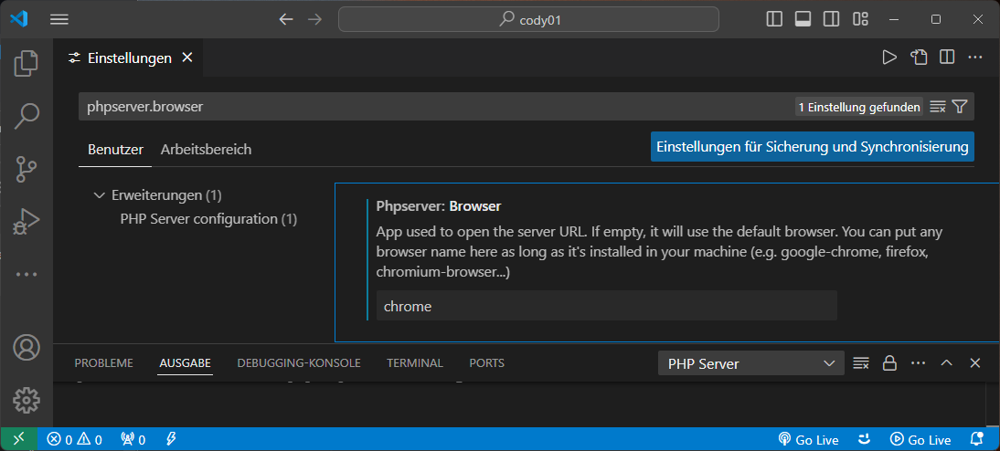
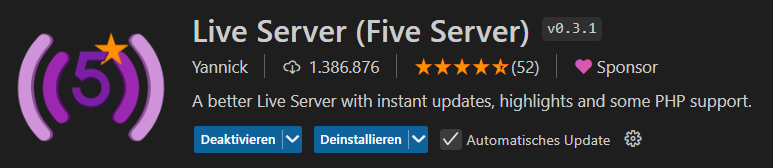
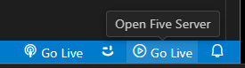
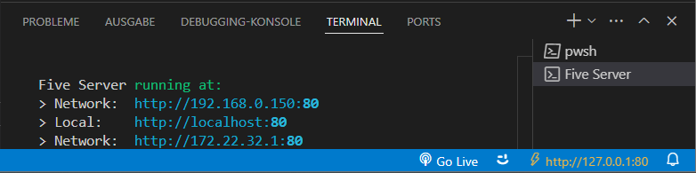

## Einstellungen



> Datei / Einstellungen / Einstellungen

## Standardbrowser für den PHP-Server

Um den Standardbrowser für den PHP-Server in Visual Studio Code zu ändern, settings.json in VS Code anpassen.



``` "phpserver.browser": "chrome" ```

Damit wird festgelegt, dass der PHP-Server Chrome als Standardbrowser startet, wenn das Projekt ausgeführt wird.


## HTML-Anwendung ausführen

Web-Server starten, und zu index.html im Browser navigieren.

## Live Server (Five Server)

Five Server Erweiterung installieren


Web-Server starten.


im Browser navigieren.



